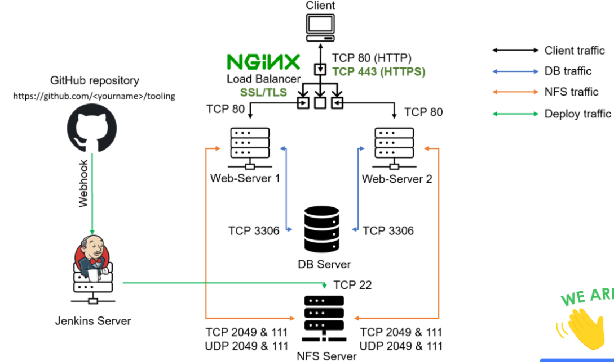

# __LOAD BALANCER SOLUTION WITH NGINX AND SSL/TLS__

During this project I will do the following:

1. Register a new domain name and connect to route 53
1. Configure Nginx as a Load Balancer




## Configure Nginx As A Load Balancer

In order to do this I completed the following:

1. Created an EC2 VM based on Ubuntu Server 20.04 LTS and opened TCP port 80 for HTTP connections and TCP port 443

1. Updated /etc/hosts file for local DNS with Web Servers’ names (e.g. Web1 and Web2) and their local IP addresses

1. Installed and configured Nginx as a load balancer to point traffic to the resolvable DNS names of the webservers

- Updated /etc/hosts file for local DNS with Web Servers' name and their local IP addressess.

```
sudo vi /etc/hosts
```

To update the server depositry and install nginx I executed this command:

```
sudo apt update && sudo apt install nginx
```

*screenshot below*


- In order to Configure Nginx LB using Web Servers’ names defined in  /etc/hosts I created a config file by executing the below command:

```
sudo vi /etc/nginx/nginx.conf 
```

- The confiuration below was inserted and saved 

```
upstream web {
    server <Private ip address>;
    server <private ip address>;
  }

server {
    listen 80;
    server_name esthertooling.co.uk www.esthertooling.co.uk;
    location / {
      proxy_pass http://web;
    }
  }

  ```


- checked that nginx was successfully configured with this command: 

```
sudo nginx -t
```

*screenshot below*


- Restart Nginx and made sure the service is up 

```
sudo systemctl restart nginx

 sudo systemctl status nginx.
```


                                                        
## Register a new domain name and connect to route 53

- I registered a www.esthertooling.co.uk on go daddy. 
- I then went unto the route 53 dashboard on AWS and created a hosted zone, connected this to my domain. This will tell route 53 to respond to DNS queries for my domain.  
- I Assigned an Elastic IP to your Nginx LB server and associated the domain name with this Elastic IP, the purpose of this is to ensure that the public IP address is static because everytime you restart, stop or start your EC2 instance, you get a new public IP address. When you want to associate your domain name, it is better to have a static IP address that does not change after reboot, thus Elastic IP is the solution for this problem.

*screenshot below*


  ## configure secured connection using SSL/certificates                                                      

- I installed certbot and dependencies by executing the following command: 

```
sudo apt install certbot -y

sudo apt install python3-certbot-nginx -y

```

- executed the below commands to checked syntax and reload nginx:

```
sudo nginx -t && sudo nginx -s reload

#Make sure snap service is running 
sudo systemctl status snapd
```

*screenshot below*


- In order to create a certificate for my domain to make it secure I executed this command 

```
sudo certbot --nginx -d esthertooling.co.uk -d www.esthertooling.co.uk
```

- A valid email address was entered and service agreement accepted. To increase security I selected for incoming request from port 80 to be redirected to port 443.

*screenshot below showing site is secure*


- Created a cron assignment so that the certificate will automatically renew each time it expires by executing this command:


```
crontab -e
```

Inserted the below command which will be executed every 12 minutes of every hour:


```
* */12 * * *   root /usr/bin/certbot renew > /dev/null 2>&1
```

- Set up periodical renewal of your SSL/TLS certificate. By default, LetsEncrypt certificate is valid for 90 days, so it is recommended to renew it at least every 60 days or more frequently.


