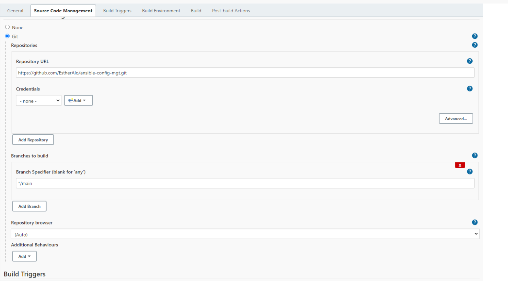

# __ANSIBLE AUTOMATION PROJECT__

## INSTALL AND CONFIGURE ANSIBLE ON EC2 INSTANCE

Ansible was installed unto my Jenkins server and Ansible version was checked

*screenshot below*


Created a new Freestyle project ansible in Jenkins and pointed it to my‘ansible-config-mgt’ repository.

*screenshot below*



Configured a Post-build job to save all (**) files
Created a new repository in Github, named it ansible-config-mgt 
Configured Webhook and set webhook to trigger ansible build.

Tested my setup by making some change in README.MD file in master branch and made sure that  builds starts automatically and that Jenkins saved the files (build artifacts) in following folder

```
ls /var/lib/jenkins/jobs/ansible/builds/<build_number>/archive/
```

*screenshot below*


### Prepare my development environment using Visual Studio Code

I configured an IDE (VCS) to connect to my ansible config respository

## BEGIN ANSIBLE DEVELOPMENT

The below command was executed within vsc in order to create a new branch that will be used for development of a new feature

```
git checkout -b prj-11
```

Created a 'playbooks' and 'inventory' directory and within the playbooks directory I created a playbook (common.yml). Within the inventory file I created a file for each development stage (Development, Staging Testing and Production)

### Set up an Ansible Inventory

 Ansible uses TCP port 22 by default, which means it needs to ssh into target servers from Jenkins-Ansible host.

 In order to achieve this I  executed below command on the admin terminal

```
Get-Service ssh-agent | Set-Service -StartupType Automatic -PassThru | Start-Service
```
*Screenshot below*


```
ssh-add <path to the key>
```

I then ssh'd into the Jenkins-Ansible server using ssh-agent

```
ssh -A ubuntu@public-ip
```


To check that I was able to connect to my RHEL and ubuntu target servers I executed the following commands

```
ssh ec2-user@<privateipaddress>

ssh ubuntu@<privateipadress>
```

*Screenshot showing I was able to ssh into my webserver*


The inventory/dev.yml file was updated with the code below:


```
[nfs]
<NFS-Server-Private-IP-Address> ansible_ssh_user='ec2-user'

[webservers]
<Web-Server1-Private-IP-Address> ansible_ssh_user='ec2-user'
<Web-Server2-Private-IP-Address> ansible_ssh_user='ec2-user'

[db]
<Database-Private-IP-Address> ansible_ssh_user='ec2-user' 

[lb]
<Load-Balancer-Private-IP-Address> ansible_ssh_user='ubuntu'
```


## CREATE A COMMON PLAYBOOK

 The below playbook is divided into two parts, each of them is intended to perform the same task: install wireshark utility (or make sure it is updated to the latest version) on my RHEL 8 and Ubuntu servers. It uses root user to perform this task and respective package manager: yum for RHEL 8 and apt for Ubuntu.

 
```
 - name: update web, nfs and db servers
  hosts: webservers, nfs, db
  remote_user: ec2-user
  become: yes
  become_user: root
  tasks:
    - name: ensure wireshark is at the latest version
      yum:
        name: wireshark
        state: latest

- name: update LB server
  hosts: lb
  remote_user: ubuntu
  become: yes
  become_user: root
  tasks:
    - name: Update apt repo
      apt: 
        update_cache: yes

    - name: ensure wireshark is at the latest version
      apt:
        name: wireshark
        state: latest

```

### Update GIT with the latest code

To Commit the code into GitHub i executed the below command and made a pull request:

```
git status

git add <selected files>

git commit -m "commit message"


```

*Screenshot showing pull request successful*

To verifiy that all artifacts were saved within my jenkin-ansible I executed the below commad:

```
/var/lib/jenkins/jobs/ansible/builds/<build_number>/archive/
```

*screenshot below*


## RUN FIRST ANSIBLE TEST

Updated config file with below code and connected to ansible via ssh on vscode 

Host jenkins_ansible
    Host name <Public ip>
    User ubuntu
    IdentityFile <path to pem>
    ForwardAgent yes
    ControlPath /tmp/ansible-ssh-%h-%p_%r
    ControlMaster auto
    ControlPersist 10m

   
   
 Opened the ubuntu home directory into vscode.


To execute ansible-playbook command and verify that the playbook works I executed the below command. 

ansible-playbook -i /var/lib/jenkins/jobs/ansible/builds/5/archive/inventory/dev.yml /var/lib/jenkins/jobs/ansible/builds/5/archive/playbooks/common.yml

To verify on each server that wireshark was installed I executed the below command:

```
which wireshark
```


