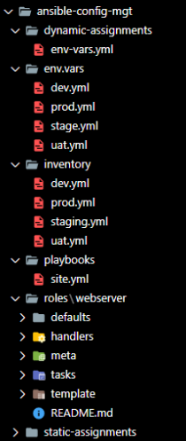
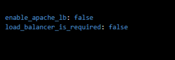

# __INTRODUCING DYNAMIC ASSIGNMENT INTO OUR STRUCTURE__

- Within my Github repositry (ansible_config_mgt) I created a new folder, named dynamic-assignments. Then inside this folder, created a new file and named it env-vars.yml. I later instructed site.yml to include this playbook later.

- started a new branch and called it dynamic-assignments.

```
git checkout -b dynamic-assignments
```

- Since I planned to used the same Ansible to configure multiple environments, and each of these environments had certain unique attributes, such as servername, ip-address etc I created new folder env-vars, then for each environment, create new YAML files which we will use to set variables.

*screenshot below*



- Input the below code into the env-vars.yml file.

```
---
- name: collate variables from env specific file, if it exists
  hosts: all
  tasks:
    - name: looping through list of available files
      include_vars: "{{ item }}"
      with_first_found:
        - files:
            - dev.yml
            - stage.yml
            - prod.yml
            - uat.yml
          paths:
            - "{{ playbook_dir }}/../env-vars"
      tags:
        - always
```


I used include_vars syntax instead of include, this is because Ansible developers decided to separate different features of the module. From Ansible version 2.8, the include module is deprecated and variants of include_* must be used. These are:

- include_role
- include_tasks
- include_vars

In the same version, variants of import were also introduces, such as:

- import_role
- import_tasks

I made use of special variables {{ playbook_dir }} and {{ inventory_file }}. {{ playbook_dir }} will help Ansible to determine the location of the running playbook, and from there navigate to other path on the filesystem.

{{ inventory_file }} on the other hand will dynamically resolve to the name of the inventory file being used, then append .yml so that it picks up the required file within the env-vars folder.

Including the variables using a loop. with_first_found implies that, looping through the list of files, the first one found is used. This is good so that I can always set default values in case an environment specific env file does not exist.

## UPDATE SITE.YML WITH DYNAMIC ASSIGNMENTS

Updated site.yml file to make use of the dynamic assignment. 

*Screenshot below*


## Download Mysql Ansible Role

I used a MySQL role developed by geerlingguy.

- On Jenkins-Ansible server I made sure that git is installed with git --version, then went into the ‘ansible-config-mgt’ directory and executed the below commands

```
git init
git pull https://github.com/<your-name>/ansible-config-mgt.git
git remote add origin https://github.com/<your-name>/ansible-config-mgt.git
git branch roles-feature
git switch roles-feature
```

- Inside roles directory I created a new MySQL role.

```
ansible-galaxy install geerlingguy.mysql 
```

renamed the folder to mysql

```
mv geerlingguy.mysql/ mysql
```

- When you install roles it automatically puts it into .ansible directory so this was moved to roles folder created previously

- Read README.md file, and edited roles configuration to use correct credentials for MySQL required for the tooling website.

*screenshot below*


uploaded the changes into GitHub


```
git add .
git commit -m "Commit new role files into GitHub"
git push --set-upstream origin roles-feature
```

- Create a pull request amd merge it with the main branch on Github.


## LOAD BALANCER ROLES

- In order to be able to choose which Load Balancer to use, Nginx or Apache, two roles were needed (Nginx and Apache)

- Installed the Nginx Ansible Role and rename the folder to nginx

```
ansible-galaxy install geerlingguy.nginx
mv geerlingguy.nginx/ nginx
```

Installed the Apache Ansible Role and rename the folder to apache

```
ansible-galaxy install geerlingguy.apache 
mv geerlingguy.apache/ apache
```

- You cannot use both Nginx and Apache load balancer, you need to add a condition to enable either one – this is where you can make use of variables. 

- Declared a variable in defaults/main.yml file inside the Nginx and Apache roles. Name each variables enable_nginx_lb and enable_apache_lb respectively. Set both values to false like this enable_nginx_lb: false and enable_apache_lb: false. Declared another variable in both roles load_balancer_is_required and set its value to false as well

*screenshot below*




created a loadbalancers.yml file within static assignments 

```
- hosts: lb
  roles:
    - { role: nginx, when: enable_nginx_lb and load_balancer_is_required }
    - { role: apache, when: enable_apache_lb and load_balancer_is_required }
```

site.yml file

```
     - name: Loadbalancers assignment
       hosts: lb
         - import_playbook: ../static-assignments/loadbalancers.yml
        when: load_balancer_is_required 
```

-  Used the  env-vars\uat.yml file to define which loadbalancer to use in UAT environment by setting respective environmental variable to true

```
enable_nginx_lb: true
load_balancer_is_required: true
```

- I was able to switch to apache lb  by setting respective environmental variable to true and other to false.