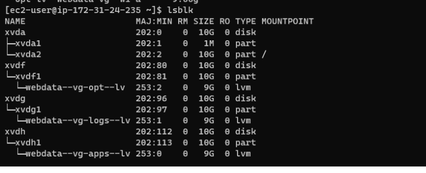
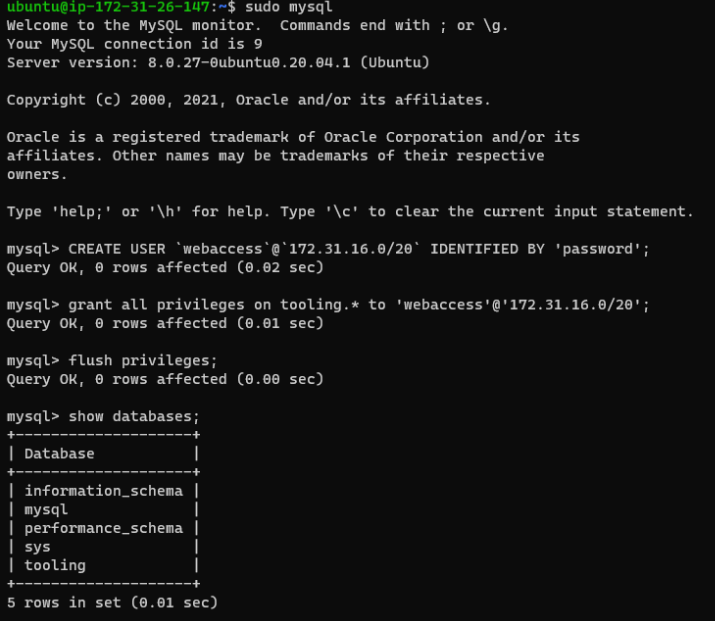

# __DEVOPS TOOLING WEBSITE SOLUTION__

In this project I will implement a solution that consists of following components:

1. Infrastructure: AWS
1. Webserver Linux: Red Hat Enterprise Linux 8
1. Database Server: Ubuntu 20.04 + MySQL
1. Storage Server: Red Hat Enterprise Linux 8 + NFS Server
1. Programming Language: PHP
1. Code Repository: GitHub

- The diagram below shows 3 stateless Web Servers sharing a common database and also accessing the same files using Network File System as a shared filed storage, which can also be used for back up in case a server crashes. As a result the content of the server is secured and safe.


# PREPARE NFS SERVER

- Launched an EC2 instance with RHEL that will serve as "NFS Server" and attached three volumes with the availability zone same as the instance type. To inspect what block devices are attached to the server I ran this command: lsblk 


*screenshot below*


- I used gdisk utility to create a single partition on each of the 3 disks  

*Screenshot below*

 sudo gdisk /dev/xvdf

 sudo gdisk /dev/xvdg

 sudo gdisk /dev/xvdh

 


- To view the newly configured partition on each of the 3 disks the lsblk command:

*Screenshot below*


- I ran the following command to install lvm2

```
sudo yum install lvm2
```

- Used pvcreate utility to mark each of 3 disks as physical volumes (PVs) to be used by LVM and verified that the physical volumes had been created successfully

```
sudo pvcreate /dev/xvdf1
sudo pvcreate /dev/xvdg1
sudo pvcreate /dev/xvdh1
```

*screenshot below*


- To add all 3 PVs to a volume group (VG) I run the following command:

```
sudo vgcreate webdata-vg /dev/xvdh1 /dev/xvdg1 /dev/xvdf1
```
                                                                
- Verification that the VG has been created successfully by running:

```
sudo vgs
```

*screenshot below*


- I created 3 logical volumes. apps-lv, and logs-lv. apps-lv will be used to store data for the Website while, logs-lv will be used to store data for logs

```
sudo lvcreate -n apps-lv -L 9G webdata-vg
sudo lvcreate -n logs-lv -L 9G webdata-vg
sudo lvcreate -n opt-lv -L 9G webdata-vg
```

- I verfied that the Logical Volume had been created successfully by running: 

```
sudo lvs
```

*screenshot below*


- To confirm the whole set up I ran the following commands:

```
sudo vgdisplay -v #view complete setup - VG, PV, and LV

sudo lsblk 
```
*Screenshot below*



- I used mkfs.xfs to format the logical volumes with xfs filesystem with the commands below: 

```
sudo mkfs -t xfs /dev/webdata-vg/apps-lv
sudo mkfs -t xfs /dev/webdata-vg/logs-lv
sudo mkfs -t xfs /dev/webdata-vg/opt-lv
```

- Created mount points on /mnt directory for the logical volumes and mounted:

*Screenshot below*


- To install, configure the NFS to start on reboot and confirm that it is running I ran the commands below:

```
sudo yum -y update
sudo yum install nfs-utils -y
sudo systemctl start nfs-server.service
sudo systemctl enable nfs-server.service
sudo systemctl status nfs-server.service
```

- Permission was updated to allow our Web servers to read, write and execute files on NFS by running the following commands:

```
sudo chown -R nobody: /mnt/apps
sudo chown -R nobody: /mnt/logs
sudo chown -R nobody: /mnt/opt

sudo chmod -R 777 /mnt/apps
sudo chmod -R 777 /mnt/logs
sudo chmod -R 777 /mnt/opt

sudo systemctl restart nfs-server.service
```

- To Configure access to NFS for clients within the same subnet I opened the exports file located in the etc directory and the following commands were entered:


```
/mnt/apps <Subnet-CIDR>(rw,sync,no_all_squash,no_root_squash)
/mnt/logs <Subnet-CIDR>(rw,sync,no_all_squash,no_root_squash)
/mnt/opt <Subnet-CIDR>(rw,sync,no_all_squash,no_root_squash)
```
- I ran the command below to check  which port is used by NFS and open it within the Security Groups:

```
rpcinfo -p | grep nfs
```

*screenshot below*


- In order for NFS server to be accessible from the client, following ports: TCP 111, UDP 111, UDP 2049

 # CONFIGURE THE DATABASE SERVER

 - The RHEL repositries were updated and Mysql was installed.

```
sudo apt install mysql-server

sudo systemctl start mysql 

sudo systemctl enable mysql 

sudo systemctl status mysql

sudo mysql_secure_installation
```

 
  I then created a database called tooling, a database user (webaccess) and granted permission to webaccess user on tooling database to do anything only from the webservers subnet cidr. 

 *Screenshot showing database has been created*

 


- Set the bind address 0000 in mysql.cnf

sudo vi /etc/mysql/mysql.conf.d/mysqld.cnf 

- restart mysql sudo systemctl restart mysql.


## Prepare the Web Servers

During this process I did the following:

1. Configured NFS client on 3 web servers
1. Deployed a Tooling application to my Web Servers into a shared NFS folder
1. Configured the Web Servers to work with a single MySQL database

- I launched 3 new EC2 instance with RHEL 8 Operating System, updated the respositries and installed NFS. 

```
 sudo yum install nfs-utils nfs4-acl-tools -y
 sudo systemctl start nfs-server
 sudo systemctl enable nfs-server
 sudo systemctl status nfs-server 
```

- A www directory was created and the NFS server export for apps was mounted on /var/www using the below commands:

```
sudo mkdir /var/www
sudo mount -t nfs -o rw,nosuid <NFS-Server-Private-IP-Address>:/mnt/apps /var/www
```

I verified NFS was mounted succesfully:

*screenshot below*


- To ensure that the changes will will persist on Web Server after reboot I entered the below command into the ftsab file which is located in the ect directory and restarted the server:

```
sudo vi /etc/fstab

<NFS-Server-Private-IP-Address>:/mnt/apps /var/www nfs defaults 0 0
```
- Reloaded server with below command:

```
sudo systemctl daemon-reload
```

- The following commands were entered to install Remi’s repository, Apache and PHP:

```
sudo yum install httpd -y

sudo dnf install https://dl.fedoraproject.org/pub/epel/epel-release-latest-8.noarch.rpm

sudo dnf install dnf-utils http://rpms.remirepo.net/enterprise/remi-release-8.rpm

sudo dnf module reset php

sudo dnf module enable php:remi-7.4

sudo dnf install php php-opcache php-gd php-curl php-mysqlnd

sudo systemctl start php-fpm

sudo systemctl enable php-fpm

sudo setsebool -P httpd_execmem 1
```

- To verify whether NFS was mounted correctly I created a new file called test.md from my web server and checked whether it was visible within my NFS server:

*screenshot below*


- The log file for Apache was located on the Web Server. The folder contained content and once mounted this will be deleted. In order to avoid this I moved the content  and created a new httpd with the below command:

```
sudo mv /var/log/httpd /var/log/httpd.bak

sudo mkdir /var/log/httpd
```
 - mounted to the NFS server’s export for logs to var/log/httpd, updated the fstab to ensure changes will persist on web server after reboot and reloaded.

```
 sudo mount -t nfs -o rw,nosuid <NFS Private IP address>:/mnt/logs /var/log/httpd

 sudo systemctl daemon-reload 
```
- Copy the content of httpd.bak into httpd folder since mount has already taken place 

```
sudo cp -R /var/log/httpd.bak/. /var/log/httpd
```

- Git was installed and tooling source code from Darey.io was forked into my github account. 

```
 sudo yum install git

 git clone https://github.com/EstherAlo/tooling.git

- The tooling website’s code was deployed to the Webserver and the html folder from the repository was also deployed to /var/www/html

```
sudo cp -R ~/tooling/html/. /var/www/html
```
Disabled Apache default page and restarted httpd

```
sudo mv /etc/httpd/conf.d/welcome.conf /etc/httpd/conf.d/welcome.conf_backup

sudo systemctl restart httpd.
```

*Screenshot below*


- I disabled SELinux sudo setenforce 0 and to make this change permanent – opened  config file /etc/sysconfig/selinux and set SELINUX=disabled. Apache was restarted and status checked.


*Screenshot below*


- Updated the website’s configuration with tooling script to connect to the database (in /var/www/html/functions.php file)

```
mysql -h <databse-private-ip> -u <db-username> -p <db-pasword> < tooling-db.sql
```

- Installed my mysql rule into my security groups of my database and edited the binding address in  /etc/mysql/mysql.conf.d/mysqld to 0.0.0.0


- The website below was generated using the public ip address of all webservers created and I was able to login!

*screenshot below*


