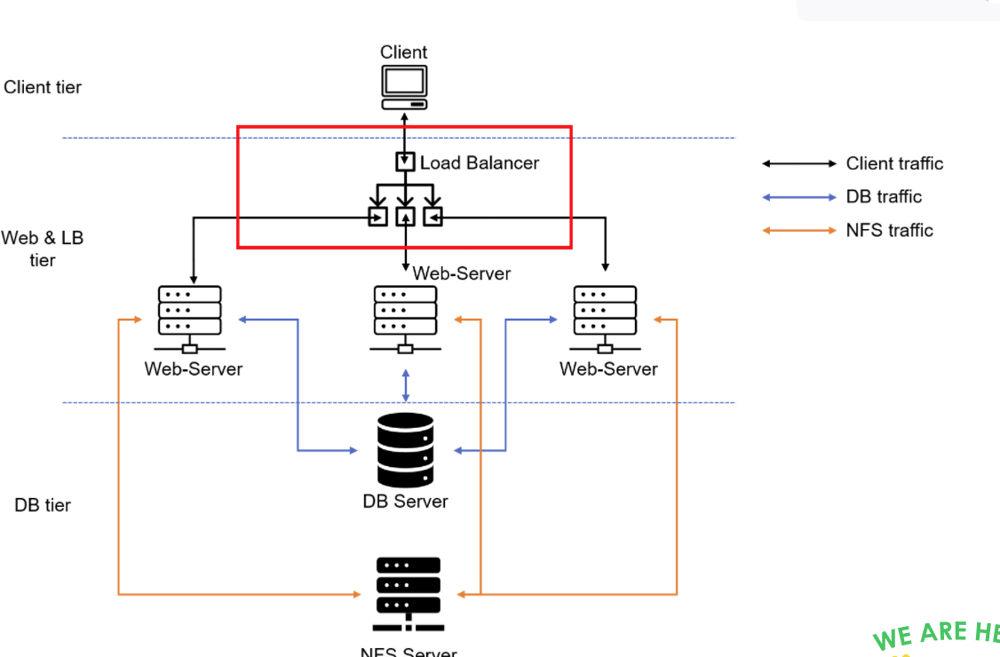
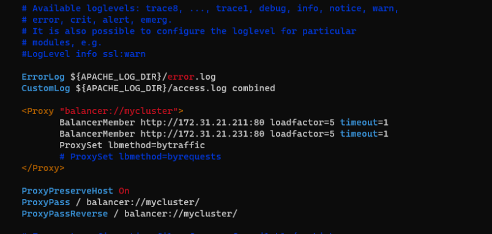

# __CONFIGURING APACHE AS A LOAD BALANCER__

- A Load Balancer (LB) distributes clients’ requests among underlying Web Servers and makes sure that the load is distributed in an optimal way. 
- In this project I will enhance my Tooling Website solution by adding a Load Balancer to distribute traffic between Web Servers and allow users to access my website using a single URL.



Prior to this project I had the following servers installed and configured within:

1. Two RHEL8 Web Servers
1. One MySQL DB Server (based on Ubuntu 20.04)
1. One RHEL8 NFS server


## Configure Apache As A Load Balancer

- I created an ubuntu server and opened port 80 by creating an Inbound Rule in Security Group


- The Apache Load Balancer was installed and configured to point traffic coming to LB to both Web Servers with the below commands:

```
#Install apache2
sudo apt update
sudo apt install apache2 -y
sudo apt-get install libxml2-dev

#Enable following modules:
sudo a2enmod rewrite
sudo a2enmod proxy
sudo a2enmod proxy_balancer
sudo a2enmod proxy_http
sudo a2enmod headers
sudo a2enmod lbmethod_bytraffic

#Restart apache2 service
sudo systemctl restart apache2
```

- The Below configuraton was entered into/etc/apache2/sites-available/000-default.conf. The command below allows the apache server to map the ip addresses of the web server to this load balancer.

```
sudo vi /etc/apache2/sites-available/000-default.conf

<Proxy "balancer://mycluster">
               BalancerMember http://<WebServer1-Private-IP-Address>:80 loadfactor=5 timeout=1
               BalancerMember http://<WebServer2-Private-IP-Address>:80 loadfactor=5 timeout=1
               ProxySet lbmethod=bytraffic
               # ProxySet lbmethod=byrequests
        </Proxy>

        ProxyPreserveHost On
        ProxyPass / balancer://mycluster/
        ProxyPassReverse / balancer://mycluster/

```
*screemshot below*


- The bytraffic balancing method will distribute incoming load between the Web Servers according to current traffic load and the I can control in which proportion the traffic must be distributed by loadfactor parameter.

- Verified that my configuration works by entering the LB public ip address into browser 

- Opened two terminals for both Web Servers and run following command: 

```
sudo tail -f /var/log/httpd/access_log
```


- Refreshed my LB browser several times to make sure that both servers receive HTTP GET requests from the LB – new records appeared in each server’s log file. 

The number of requests to each server were approximately the same since I set loadfactor to the same value for both servers – this means that traffic will be disctributed evenly between them.

