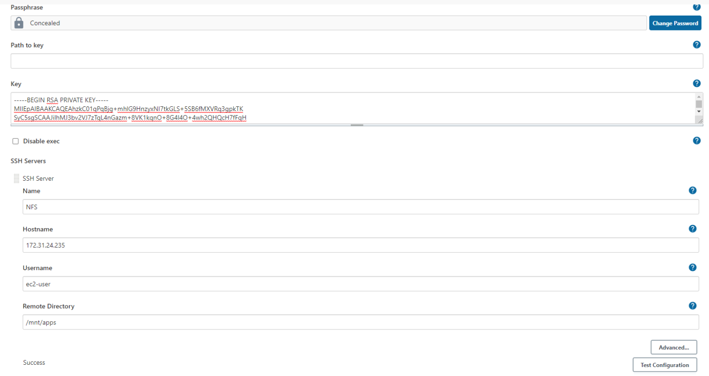

# __CONTINOUS INTERGRATION PIPELINE FOR TOOLING WEBSITE__

## Install Jenkins server

I created an AWS EC2 server based on Ubuntu Server 20.04 LTS and named it "Jenkins". Following this I installed JDK and Jenkins and ensured it was up and running:

*Screenshot below*


Jenkins default server TCP port 8080 so a new Inbound Rule was created within my EC2 Security Group

*Screenshot below*


I accessed Jenkins via my browser and was prompted to provide a default admin password. I retrieved this by running this command:

```
sudo cat /var/lib/jenkins/secrets/initialAdminPassword
```

Following this suggested plugins were installed and an admin user was created.

## Configure Jenkins to retrieve source codes from GitHub using Webhooks

Here I configured a simple Jenkins job. This job was triggered by GitHub webhooks and was executed as a ‘build’ task to retrieve codes from GitHub and store it locally on Jenkins server.

I enabled webhooks in my GitHub repository settings, after this I created a freestyle project in the Jenkins console. In configuration of my Jenkins freestyle project I inserted the  link to my Tooling GitHub repository and credentials so Jenkins could access files in the repository.

I saved the configuration and ran the build manually - this was successful

*Screenshot below*


In order for the build to run automatically I added the following configurations:

 'GitHub hook trigger for GITScm polling ' and 'post-build actions' - to archive all the files.


To confirm whether a new build has been launched automatically (by webhook) and see its results – artifact, I made some change in any file in the  README.MD file) and pushed the changes to the master branch. The screenshot below shows that a new build has been launched automatically (by webhook) and you can see its results – artifacts, saved on Jenkins server.


## CONFIGURE JENKINS TO COPY FILES TO NFS SERVER VIA SSH

Once artifacts were saved locally on Jenkins server I copied them to the /mnt/apps directory within the NFS server. In order to do this I installed plugin called  "Publish Over SSH".

In order to onfigure the job/project to copy artifacts over to NFS server I selected "Manage Jenkins" and chose "Configure System" menu item. In the Publish over SSH plugin configuration section I provided the private key, arbitrary name, hostname, username and remote directory path. This was tested and saved.

*Screenshot below*



I added a post-build action to 'send build artifacrs over SSH' and inserted 2 asterixs which onfigures it to send all files produced by the build into my previously defined remote directory. Once saved Webhook trigger a new job which was a success.

*Screenshot below*


This command was executed in th NFS server to make sure that the files in /mnt/apps have been updated:

```
cat /mnt/apps/README.md
```

I was able to see the changes previously made within my GitHub!