## __EXPERIENCE CONTINUOUS INTEGRATION WITH JENKINS | ANSIBLE | ARTIFACTORY | SONARQUBE | PHP__

- This project is continuation of project 13

- Add a SonarQube role: SonarQube is an open-source platform developed by SonarSource for continuous inspection of code quality, it is used to perform automatic reviews with static analysis of code to detect bugs, code smells, and security vulnerabilities.

- Add a Artifactory role: Artifactory is a product by JFrog that serves as a binary repository manager. The binary repository is a natural extension to the source code repository, in that the outcome of your build process is stored. It can be used for certain other automation, but we will it strictly to manage our build artifacts.

## Configuring Ansible For Jenkins Deployment

- Install Blue Ocean plugin in Jenkins Manage Jenkins and open it when installed.

- Select 'create a new pipeline'

*screenshot below*


- Select 'GitHub'

*screenshot below*
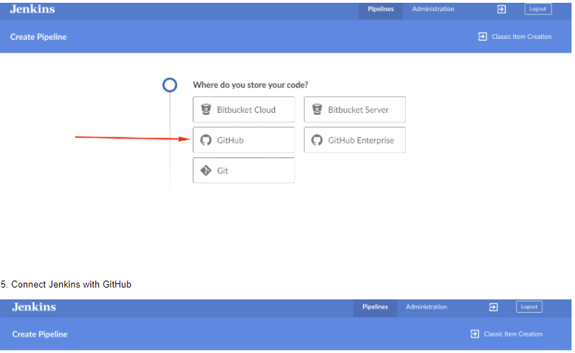


- Select 'Create an access token'

*screenshot below*


- Name the token and generate 

*screenshot below*
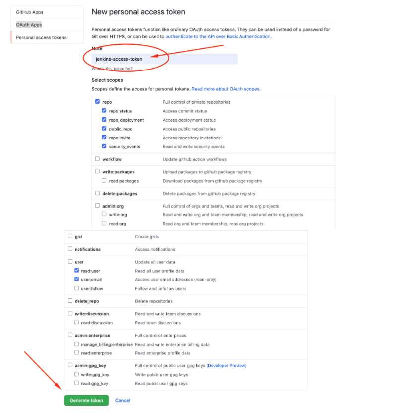


- Copy the access token 

*screenshot below*
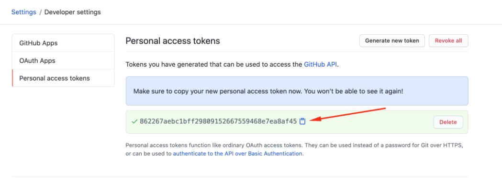


Paste the tpken and connect

*screenshot below*
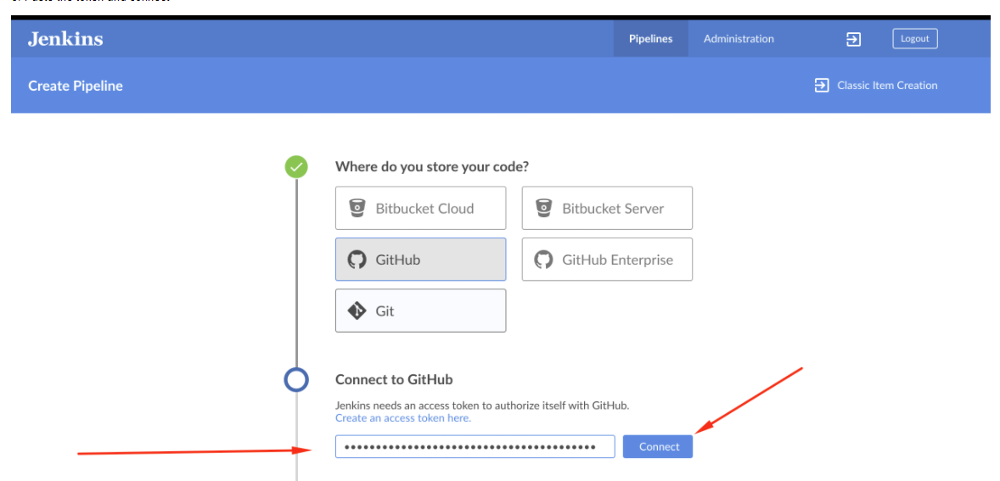


- Select 'create a new pipeline' and select repository

*screenshot below*


Click on 'new pipeline and click adminstration to exit Blue Ocean.

*screenshot below*
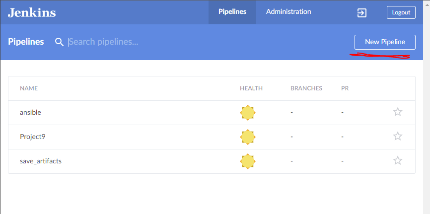

- Create a new directory 'deploy' and start a new file 'Jenkinsfile' inside the directory

- Add the code snippet below to start building the Jenkinsfile gradually. This pipeline currently has just one stage called Build and the only thing we are doing is using the shell script module to echo Building Stage.

```
pipeline {
    agent any

    stages {
      stage('Build') {
        steps {
          script {
            sh 'echo "Building Stage"'
          }
        }
      }
    }
}
```

 - push code to the main repository.

 - Go back into the Ansible_config_mgt pipeline in Jenkins, and select 'configure'

 *screenshot*
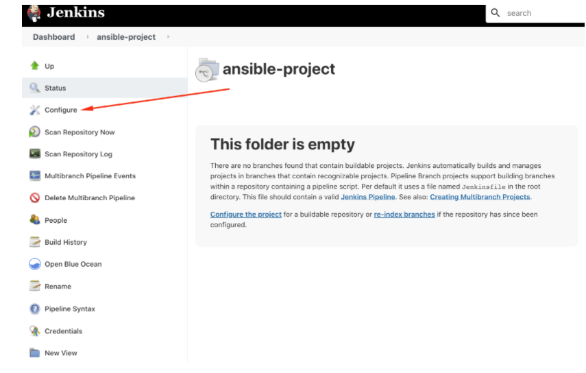

 - In the configure section , go to the build configuration under Script path and specify the path were the jenkinsfile is, then save the settings.

 *screenshot below*
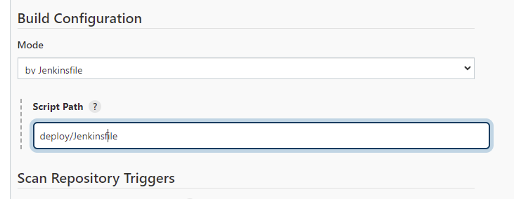

 - Immediately the jenkins file path is set the job will start building automatically, then open Blue Ocean in a different tab to see the build.

 *screenshot below*
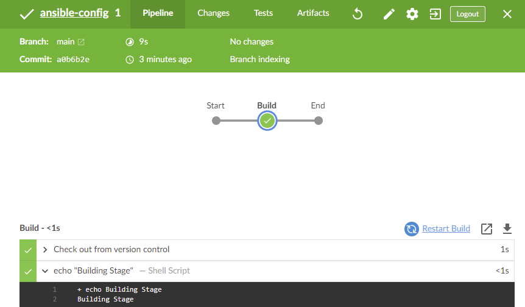

 - This pipeline is a multibranch one, which means that if there were more than one branch in GitHub, Jenkins would have scanned the repository to discover them all and we would have been able to trigger a build for each branch

- Create a new git branch and name it feature/jenkinspipeline-stages

```
git checkout -b feature/jenkinspipeline-stages
```

Enter the below code snippet below an push the new changes

```
pipeline {
    agent any

    stages {
      stage('Build') {
        steps {
          script {
            sh 'echo "Building Stage"'
          }
        }
      }

    stage('Test') {
      steps {
        script {
          sh 'echo "Testing Stage"'
        }
      }
    }
   }
}
```

- To ensure that Jenkins detects our new branch, go to the ansible-config-mgt jobs and click on Scan Repository and refresh the page to show the new branch 

*screenshot below*


- Open Blue Ocean and click on the new branch to see the content

*screenshot below*


- Push the code to the main branch from feature/jenkinspipeline-stages and the following changes will take place in the main branch

*screenshot below*
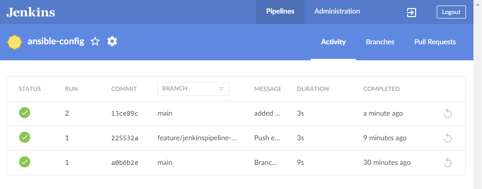

- For every job created in Jenkins, it creates a workspace for each job, thus if Jenkins perform a lot of job lots of workspace will be created which will affect storage. To avoid this type of issue, its a good practice to ensure that at the beginning of the Jenkinsfile you clean the workspace and at the end also.


- Copy the content below in the Jenkinsfile and push the code.

```
pipeline {
    agent any

  stages {
    stage("Initial cleanup") {
          steps {
            dir("${WORKSPACE}") {
              deleteDir()
            }
          }
        }
    stage('Build') {
      steps {
        script {
          sh 'echo "Building Stage"'
        }
      }
    }

    stage('Test') {
      steps {
        script {
          sh 'echo "Testing Stage"'
        }
      }
    }

    stage('Package'){
      steps {
        script {
          sh 'echo "Packaging App" '
        }
      }
    }

    stage('Deploy'){
      steps {
        script {
          sh 'echo "Deploying to Dev"'
        }
      }

    }
    
    stage("clean Up"){
       steps {
        cleanWs()
     }
    }
     
    }
}
```

- Jenkins scans each branch for any changes and it starts to build. 

*screenshot below*


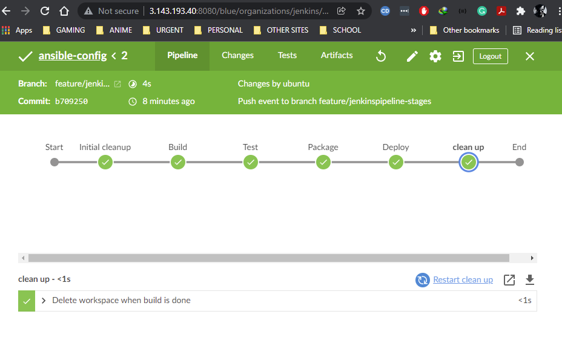


- After installing ansible plugin in the Jenkins UI, go to global tool configuration under Ansible. Give descriptive name and path to ansible executable folder. You can retrieve this with the which ansible command. copy the path ignoring the ansible part.

*screenshot below*


- In the deploy folder, create a file name ansible.cfg file and copy the content below inside the file. By default when we install ansible, we have the default configuration file in /etc/ansible/ansible.cfg, now we are creating our own config file

```
[defaults]
timeout = 160
callback_whitelist = profile_tasks
log_path=~/ansible.log
host_key_checking = False
gathering = smart
ansible_python_interpreter=/usr/bin/python3
allow_world_readable_tmpfiles=true

[ssh_connection]
ssh_args = -o ControlMaster=auto -o ControlPersist=30m -o ControlPath=/tmp/ansible-ssh-%h-%p-%r -o ServerAliveInterval=60 -o ServerAliveCountMax=60 -o ForwardAgent=yes
```

- Jenkins needs to export the ANSIBLE_CONFIG environment variable, which must be declared globally and specifies where ansible.cfg file is. The code below will be put into the jenkins file.

```
environment {
  ANSIBLE_CONFIG="${WORKSPACE}/deploy/ansible.cfg"
 }
 ```

- To run Ansible playbook via the Jenkinsfile, go to Dashoard -> Manage Jenkins -> Manage Credentials -> Credentials -> Add Credentials. Fill in the blanks, by entering content of the pem key and username (ubuntu or ec-user) To ensure our ansible run against inventory/dev

 *screenshot below*
 

- Go to Dashboard -> ansib-config -> Pipeline Sytnax, configure path to the playbook and inventory path, ssh-user and colorized output. Generate pipeline script, copy the script and paste in the Jenkinsfile.

 *screenshot below*

 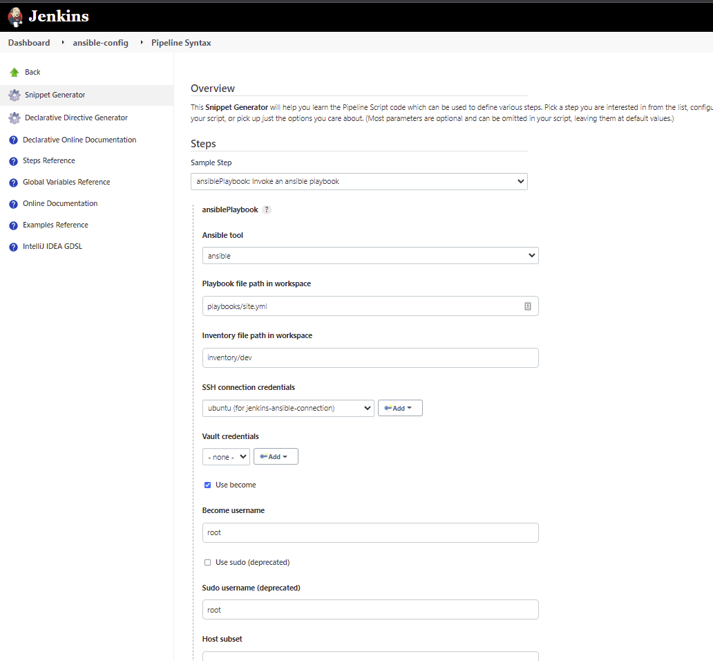

 - Copy the code below into the Jenkinsfile

```
 pipeline {
  agent any

  environment {
      ANSIBLE_CONFIG="${WORKSPACE}/deploy/ansible.cfg"
    }
    
  stages{
      stage("Initial cleanup") {
          steps {
            dir("${WORKSPACE}") {
              deleteDir()
            }
          }
        }

      stage('Checkout SCM') {
         steps{
            git branch: 'feature/jenkinspipeline-stages', url: 'https://github.com/Taiwolawal/ansible-config.git'
         }
       }

      stage('Prepare Ansible For Execution') {
        steps {
          sh 'echo ${WORKSPACE}' 
          sh 'sed -i "3 a roles_path=${WORKSPACE}/roles" ${WORKSPACE}/deploy/ansible.cfg'  
        }
     }

      stage('Run Ansible playbook') {
        steps {
           ansiblePlaybook become: true, colorized: true, credentialsId: 'private-key', disableHostKeyChecking: true, installation: 'ansible', inventory: 'inventory/${inventory}', playbook: 'playbooks/site.yml'
         }
      }

      stage('Clean Workspace after build'){
        steps{
          cleanWs(cleanWhenAborted: true, cleanWhenFailure: true, cleanWhenNotBuilt: true, cleanWhenUnstable: true, deleteDirs: true)
        }
      }
   }

}
```

- Update the inventory/dev file with 2 instances (nginx and db)


- Push the code with the new updates in the Jenkinsfile.

*screenshot below*
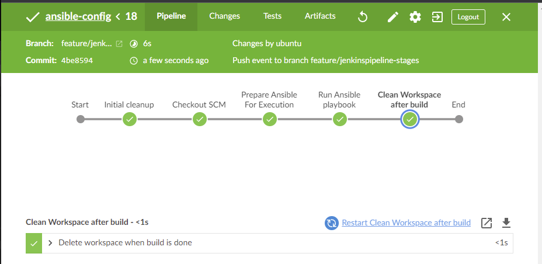
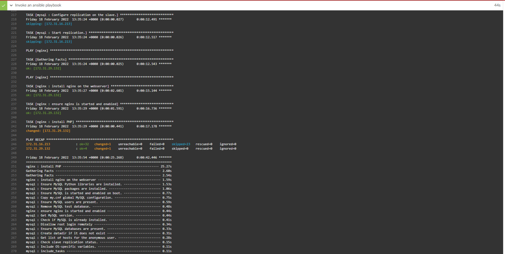

- If we need to deploy to other environment, manually updating the Jenkinfile is not an option, thus we need to use parametization.

- The parameters need to be global and edit content of 'Run Ansible Playbook'. The parameters block of the code below sets dev as the default value 

```
parameters {
      string(name: 'inventory', defaultValue: 'dev',  description: 'This is the inventory file for the environment to deploy configuration')
    }
    
 stage('Run Ansible playbook') {
    steps {
       ansiblePlaybook become: true, colorized: true, credentialsId: 'private-key', disableHostKeyChecking: true, installation: 'ansible', inventory:'${WORKSPACE}/inventory/${inventory}', playbook: 'playbooks/site.yml'
            }
```

        
- Merge code with the main branch.

- Since we included parameters in our Jenkinsfile, when you check the branch where the Jenkinfile was launched, you will see "Build with Parameters".

*screenshot below*

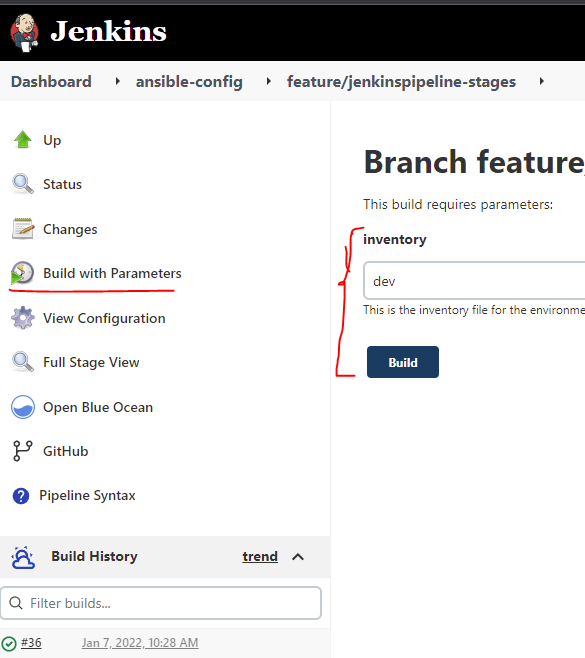

## CI/CD PIPELINE FOR TODO APPLICATION

- The aim is to deploy the application onto servers directly from Artifactory rather than from git. 

- Fork and clone the below repository to the jenkins instance outside of the ansible-config_mgt folder

https://github.com/darey-devops/php-todo.git

On the Jenkins server, install PHP, its dependencies and Composer tool

```
 sudo apt install -y zip libapache2-mod-php phploc php-{xml,bcmath,bz2,intl,gd,mbstring,mysql,zip}

 sudo apt install composer

 sudo php /tmp/composer-setup.php sudo mv composer.phar /usr/bin/composer

 sudo mv composer.phar /usr/bin/composer
 ```

*screenshot below*

 - Install the Plot Plugin and Artifactory plugin in the Jenkins UI (Manage Jenkins)

 - The plot plugin will be used to display tests reports, and code coverage information and the Artifactory plugin will be used to easily upload code artifacts into an Artifactory server.

- Create an instance for Artifactory and copy the ip address into the inventory/ci enviroment

- Configure all settings in the playbook/site.yml , roles and static assignment so as to install Artifactory.


Edit the Jenkinfile to the below and push code

```
stage('Checkout SCM') {
         steps{
            git branch: 'main', url: 'https://github.com/EstherAlo/ansible-config-mgt.git'
         }
       }
```

- In Jenkins, go to the main branch and click on Build Parameters and change to ci, as such always change the inventory path in Jenkins dashboard.

*screenshot below*


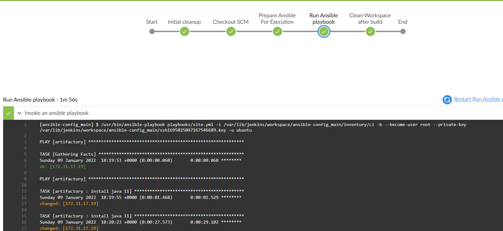


- Login into the Artifactory with port 8081 and enter username and password (admin, password), create new password

*screenshot below*

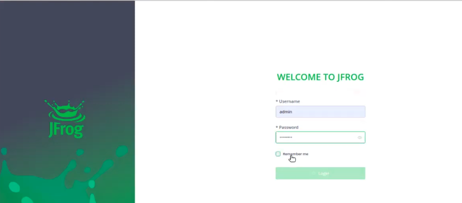

- Create repository -> Select general repository -> Generic, enter Repository Key as PBL, save and finish

- In Jenkins configure the artifactory server ID, URL and Credentials, run Test Connection

*screenshot below*
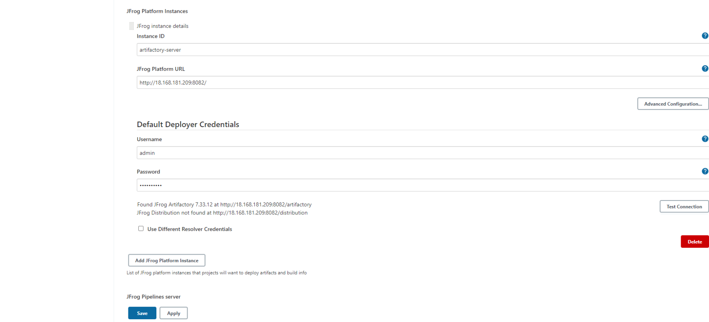


- Integrate the Artifactory repository with Jenkins by creating a Jenkinsfile in the php-todo folder and copying the content below. The required file by PHP is .env so we are renaming env.sample to .env Composer is used by PHP to install all the dependent libraries used by the applicationphp artisan uses the .env file to setup the required database objects 

```
pipeline {
    agent any

  stages {

     stage("Initial cleanup") {
          steps {
            dir("${WORKSPACE}") {
              deleteDir()
            }
          }
        }

    stage('Checkout SCM') {
      steps {
            git branch: 'main', url: 'https://github.com/EstherAlo/php-todo.git'
      }
    }

    stage('Prepare Dependencies') {
      steps {
             sh 'mv .env.sample .env'
             sh 'composer install'
             sh 'php artisan migrate'
             sh 'php artisan db:seed'
             sh 'php artisan key:generate'
      }
    }
  }
}
```

- On the database server, create database and user by updating roles -> mysql -> defaults -> main.yml. Ensure the Ip address used in the database is the ip for Jenkins server.

*screenshot below*
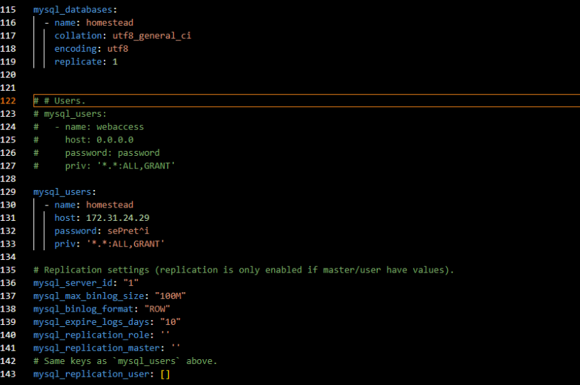

- Push the code and build (it should be done in the php-todo folder), ensure the parameter is in dev.

- To confirm the database were created and user, launch the db (mysql-server) instance and execute the code below:

```
sudo mysql 
show databases;
select user, host from mysql.user;
```
- Create a new pipeline in blue ocean and link the php-todo repo to it. It will start building since there is a jenkinsfile in it

## Connecting to MYSQL from Jenkins server 

- Set the bind address of the database of the MYSQL server to allow connections from remote hosts.

```
sudo vi /etc/mysql/mysql.conf.d/mysqld.cnf
```

- Change bind-address = 0.0.0.0 and restart mysql 

```
sudo systemctl restart mysql
```


- Install mysql client on Jenkins in the php folder 

```
sudo apt install mysql-client
```

- In the .env.sample of the mysql role update the database connectivity requirements with the screenshot below. The IP address used is for the database

*screenshot below*

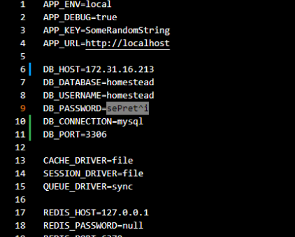

- Connect to the database from Jenkins

```
 mysql -h <mysql privateip> -u homestead -p
 ```


- Push the code in from php-todo folder

- Update the Jenkinsfile in the php folder to include Unit tests step

```
  stage('Execute Unit Tests') {
  steps {
     sh './vendor/bin/phpunit'
  } 
  ```


  You can only deploy to artifactory unless unit test has been done so add the below stage:

```
 stage('Execute Unit Tests') {
  steps {
     sh './vendor/bin/phpunit'
  } 
```

## Code Quality Analysis

  - Code Quality Analysis is one of the areas where developers, architects and many stakeholders are mostly interested in as far as product development is concerned. For PHP the most commonly tool used for code quality analysis is phploc.

  ```
  sudo apt-get install -y phploc
  ```


- Update the jenkins file with the below. The output of the data will be saved in build/logs/phploc.csv file:

```
  stage('Code Analysis') {
      steps {
        sh 'phploc app/ --log-csv build/logs/phploc.csv'
      }
    }
```

- Plot the data using the plot Jenkins plugin.

```
stage('Plot Code Coverage Report') {
      steps {

            plot csvFileName: 'plot-396c4a6b-b573-41e5-85d8-73613b2ffffb.csv', csvSeries: [[displayTableFlag: false, exclusionValues: 'Lines of Code (LOC),Comment Lines of Code (CLOC),Non-Comment Lines of Code (NCLOC),Logical Lines of Code (LLOC)                          ', file: 'build/logs/phploc.csv', inclusionFlag: 'INCLUDE_BY_STRING', url: '']], group: 'phploc', numBuilds: '100', style: 'line', title: 'A - Lines of code', yaxis: 'Lines of Code'
            plot csvFileName: 'plot-396c4a6b-b573-41e5-85d8-73613b2ffffb.csv', csvSeries: [[displayTableFlag: false, exclusionValues: 'Directories,Files,Namespaces', file: 'build/logs/phploc.csv', inclusionFlag: 'INCLUDE_BY_STRING', url: '']], group: 'phploc', numBuilds: '100', style: 'line', title: 'B - Structures Containers', yaxis: 'Count'
            plot csvFileName: 'plot-396c4a6b-b573-41e5-85d8-73613b2ffffb.csv', csvSeries: [[displayTableFlag: false, exclusionValues: 'Average Class Length (LLOC),Average Method Length (LLOC),Average Function Length (LLOC)', file: 'build/logs/phploc.csv', inclusionFlag: 'INCLUDE_BY_STRING', url: '']], group: 'phploc', numBuilds: '100', style: 'line', title: 'C - Average Length', yaxis: 'Average Lines of Code'
            plot csvFileName: 'plot-396c4a6b-b573-41e5-85d8-73613b2ffffb.csv', csvSeries: [[displayTableFlag: false, exclusionValues: 'Cyclomatic Complexity / Lines of Code,Cyclomatic Complexity / Number of Methods ', file: 'build/logs/phploc.csv', inclusionFlag: 'INCLUDE_BY_STRING', url: '']], group: 'phploc', numBuilds: '100', style: 'line', title: 'D - Relative Cyclomatic Complexity', yaxis: 'Cyclomatic Complexity by Structure'      
            plot csvFileName: 'plot-396c4a6b-b573-41e5-85d8-73613b2ffffb.csv', csvSeries: [[displayTableFlag: false, exclusionValues: 'Classes,Abstract Classes,Concrete Classes', file: 'build/logs/phploc.csv', inclusionFlag: 'INCLUDE_BY_STRING', url: '']], group: 'phploc', numBuilds: '100', style: 'line', title: 'E - Types of Classes', yaxis: 'Count'
            plot csvFileName: 'plot-396c4a6b-b573-41e5-85d8-73613b2ffffb.csv', csvSeries: [[displayTableFlag: false, exclusionValues: 'Methods,Non-Static Methods,Static Methods,Public Methods,Non-Public Methods', file: 'build/logs/phploc.csv', inclusionFlag: 'INCLUDE_BY_STRING', url: '']], group: 'phploc', numBuilds: '100', style: 'line', title: 'F - Types of Methods', yaxis: 'Count'
            plot csvFileName: 'plot-396c4a6b-b573-41e5-85d8-73613b2ffffb.csv', csvSeries: [[displayTableFlag: false, exclusionValues: 'Constants,Global Constants,Class Constants', file: 'build/logs/phploc.csv', inclusionFlag: 'INCLUDE_BY_STRING', url: '']], group: 'phploc', numBuilds: '100', style: 'line', title: 'G - Types of Constants', yaxis: 'Count'
            plot csvFileName: 'plot-396c4a6b-b573-41e5-85d8-73613b2ffffb.csv', csvSeries: [[displayTableFlag: false, exclusionValues: 'Test Classes,Test Methods', file: 'build/logs/phploc.csv', inclusionFlag: 'INCLUDE_BY_STRING', url: '']], group: 'phploc', numBuilds: '100', style: 'line', title: 'I - Testing', yaxis: 'Count'
            plot csvFileName: 'plot-396c4a6b-b573-41e5-85d8-73613b2ffffb.csv', csvSeries: [[displayTableFlag: false, exclusionValues: 'Logical Lines of Code (LLOC),Classes Length (LLOC),Functions Length (LLOC),LLOC outside functions or classes ', file: 'build/logs/phploc.csv', inclusionFlag: 'INCLUDE_BY_STRING', url: '']], group: 'phploc', numBuilds: '100', style: 'line', title: 'AB - Code Structure by Logical Lines of Code', yaxis: 'Logical Lines of Code'
            plot csvFileName: 'plot-396c4a6b-b573-41e5-85d8-73613b2ffffb.csv', csvSeries: [[displayTableFlag: false, exclusionValues: 'Functions,Named Functions,Anonymous Functions', file: 'build/logs/phploc.csv', inclusionFlag: 'INCLUDE_BY_STRING', url: '']], group: 'phploc', numBuilds: '100', style: 'line', title: 'H - Types of Functions', yaxis: 'Count'
            plot csvFileName: 'plot-396c4a6b-b573-41e5-85d8-73613b2ffffb.csv', csvSeries: [[displayTableFlag: false, exclusionValues: 'Interfaces,Traits,Classes,Methods,Functions,Constants', file: 'build/logs/phploc.csv', inclusionFlag: 'INCLUDE_BY_STRING', url: '']], group: 'phploc', numBuilds: '100', style: 'line', title: 'BB - Structure Objects', yaxis: 'Count'

      }
    }
```

- add, commit and push

*screenshot below*


- You should now see a Plot menu item on the left menu. Click on it to see the charts

- install zip firstly in order to do the below

```
sudo apt install zip -y
```


- Add the code analysis step in Jenkinsfile. The output of the data will be saved in build/logs/phploc.csv file.

```
stage('Code Analysis') {
      steps {
        sh 'phploc app/ --log-csv build/logs/phploc.csv'
      }
    }
```

- Bundle the application code into an artifact (archived package),  upload to Artifactory.

```
stage ('Package Artifact') {
      steps {
          sh 'zip -qr php-todo.zip ${WORKSPACE}/*'
      }
    }
    
 stage ('Upload Artifact to Artifactory') {
      steps {
        script { 
          def server = Artifactory.server 'artifactory-server'                 
          def uploadSpec = """{
                    "files": [
                      {
                       "pattern": "php-todo.zip",
                       "target": "PBL/php-todo",
                       "props": "type=zip;status=ready"
                       }
                    ]
                 }""" 

          server.upload spec: uploadSpec
        }
      }
  
    }
```


- Deploy the application to the dev environment by launching Ansible pipeline

```
stage ('Deploy to Dev Environment') {
      steps {
        build job: 'ansible-config-mgt/main', parameters: [[$class: 'StringParameterValue', name: 'env', value: 'dev']], propagate: false, wait: true
      }
    }
```
- spin up an instance that will be the php 'todo' server and update the inventory/dev with the private ip address


- on jfrog click on 'set me up' --> enter password --> click on deploy --> copy password. click on the artifact and the URL to be placed static assignments/deployment.yml is there.

*screenshot below*

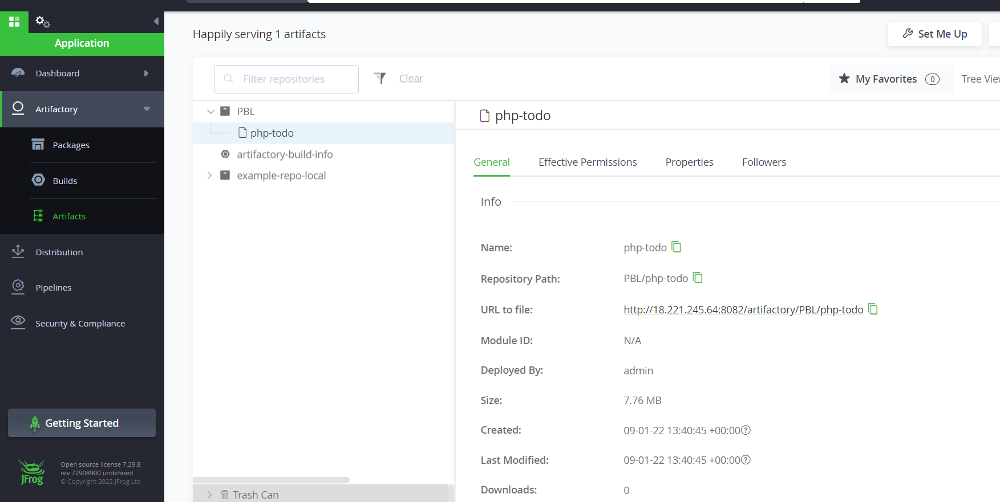

- Update the deployment.yml file in static assignments with the artifactory details such as the ip address and password.


## SONARQUBE INSTALLATION

- Even though we have implemented Unit Tests and Code Coverage Analysis with phpunit and phploc, we still need to implement Quality Gate to ensure that ONLY code with the required code coverage, and other quality standards make it through to the environments

- Create an instance for Sonarqube, the minimum requirement is 4GB RAM and 2 vCPUs and update the Ip details in ansible-config inventory/ci and site.yml for complete installation.

- Push the code and run from the build - ensure you comment out the unecesary playbooks 

- some bugs came with the screenshot below, so we had to run ansible via command line.


- To run the command we need to update the roles_path in ansible.cfg located in the deploy folder, just for the purpose of the Sonarqube installation

```
roles_path=/home/ubuntu/ansible-config/roles
```

- After updating the roles_path in the ansible.cfg, enter the following command in the terminal

```
export ANSIBLE_CONFIG=/home/ubuntu/ansible-config-mg/deploy/ansible.cfg
```

- Before running ansible-playbook ensure the ansible machine can talk to the server via SSH agent

```
ssh-add -l
```
If you you ssh agent is not running do the below:

```
eval 'ssh-agent'

ssh-add -k <privatekey.pem>

#connect to host and check if key has been added

ssh-add -l
```

- install postgresql

```
ansible-galaxy collection install community.postgresql
```

- Run ansible-playbook 


```
ansible-playbook -i inventory/ci playbooks/site.yml
```

- Connect to the sonarqube instance via port 9000, password and username is both admin.

- In Jenkins, install SonarScanner plugin. Navigate to configure system in Jenkins. Add SonarQube server as shown below:

*screenshot below*


- Generate authentication token in SonarQube

*screenshot below*
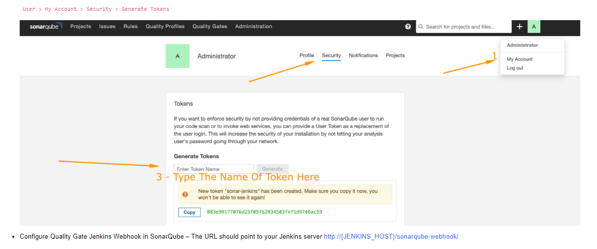

- Configure Quality Gate Jenkins Webhook in SonarQube – The URL should point to your Jenkins server http://{JENKINS_HOST}/sonarqube-webhook/

*screenshot below*


- Setup SonarQube scanner from Jenkins – Global Tool Configuration

*screenshot below*
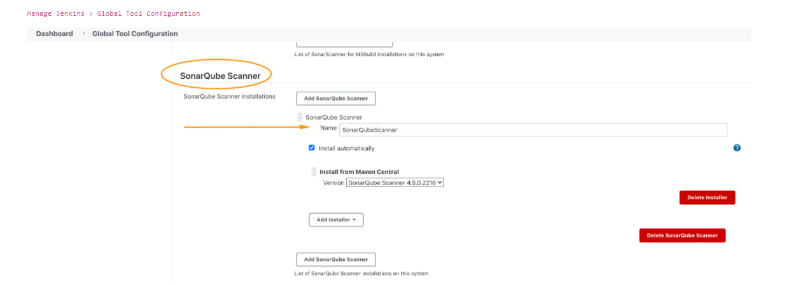

- Update Jenkins Pipeline to include SonarQube scanning and Quality Gate, it should be placed before "Package Artifact". This needs to be done before we can edit sonar-scanner.properties

```
    stage('SonarQube Quality Gate') {
        environment {
            scannerHome = tool 'SonarQubeScanner'
        }
        steps {
            withSonarQubeEnv('sonarqube') {
                sh "${scannerHome}/bin/sonar-scanner"
            }

        }
    }
    }
```


- We have to update sonar-scanner.properties for the build to work:

```
cd /var/lib/jenkins/tools/hudson.plugins.sonar.SonarRunnerInstallation/SonarQubeScanner/conf/

sudo vi sonar-scanner.properties
```

As a DevOps engineer working on the pipeline, we must ensure that the quality gate step causes the pipeline to fail if the conditions for quality are not met. If within the Sonarqube stage, it has some bugs, bad coverage and code smells as such, we do not want it to be pushed to any environment. We will update the Jenkinsfile with; 

```
stage('SonarQube Quality Gate') {
      when { branch pattern: "^develop*|^hotfix*|^release*|^main*", comparator: "REGEXP"}
        environment {
            scannerHome = tool 'SonarQubeScanner'
        }
        steps {
            withSonarQubeEnv('sonarqube') {
                sh "${scannerHome}/bin/sonar-scanner -Dproject.settings=sonar-project.properties"
            }
            timeout(time: 1, unit: 'MINUTES') {
                waitForQualityGate abortPipeline: true
            }
        }
    }

```   


